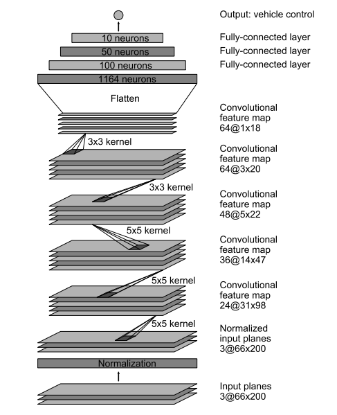

# **Behavioral Cloning**

**Behavioral Cloning Project**

The goals / steps of this project are the following:
* Use the simulator to collect data of good driving behavior
* Build, a convolution neural network in Keras that predicts steering angles from images
* Train and validate the model with a training and validation set
* Test that the model successfully drives around track one without leaving the road
* Summarize the results with a written report

## Rubric Points
### Here I will consider the [rubric points](https://review.udacity.com/#!/rubrics/432/view) individually and describe how I addressed each point in my implementation.

---
### Files Submitted & Code Quality

#### 1. Submission includes all required files and can be used to run the simulator in autonomous mode

My project includes the following files:
* `trainer.py` containing the script to create and train the model
* `sdc` python package, containing the functions used in `trainer.py`
* `drive.py` for driving the car in autonomous mode
* `model.h5` containing a trained convolution neural network
* `writeup.md` summarizing the results
* `video.mp4` showing the model driving the car

#### 2. Submission includes functional code
Using the Udacity provided simulator and my `drive.py` file, the car can be driven autonomously around the track by executing
```sh
python drive.py model.h5
```

#### 3. Submission code is usable and readable

The `trainer.py` file contains the code for loading the training and validation `driving_log` files,
re-balancing the training set, building, training and saving the convolution neural network.
For performing these operations, a group of functions are used from the `sdc` python package.
All used data loading operations could be found in `sdc/load.py`, the model building function
`build_nvidia()` could be found in `sdc/model.py` and the training data generator
`generate_images_from()` could be found in `sdc/generator.py`. `sdc/generator.py` uses
functions for image preprocessing defined in `sdc/processing.py`. The code in these files is
rather self-explanatory and additional comments are added on places where more complicated
operations are performed.

### Model Architecture and Training Strategy

#### 1. An appropriate model architecture has been employed

The network architecture of the model defined in `sdc/model.py` was chosen to be
the classic Nvidia model with a cropping layer (line 16) and a resizing layer (line 17)
in order to prepare the images to the expected input of 200x66.
The cropping layer removes the top 55 pixels of the image, since they usually contain
a lot of non-relevant information for the model like trees and sky pixels.
The bottom 25 pixels contain the front of the car, which is also unneeded for the model.
The activation function for all the layers was chosen to be the ELU activation function,
which provides non-linearity and better convergence properties than RELU activations.
The final activation was set to `tanh` due to the natural limit of the output from `-1` to `1`.

Here is an image showing the model architecture: (image taken from [Nvidia's paper](images.nvidia.com/content/tegra/automotive/images/2016/solutions/pdf/end-to-end-dl-using-px.pdf):



#### 2. Attempts to reduce overfitting in the model

The model contains 5 dropout layers in order to reduce overfitting,
3 of which are after the last 3 convolutional layers and the other 2 are after
the first fully-connected layers. The dropout values and layers were chosen
empirically.

The model was trained and validated on different data sets to ensure that the model was not overfitting,
the training sets were collected solely from track 1, where the validation set contained only track 2 images.
The model was tested by running it through the simulator and ensuring that the vehicle could stay on the track.


#### 3. Model parameter tuning

The model was trained with:
 - Adam optimizer
 - MSE
 - learning rate `1e-4` (higher learning reates resulted in worse models)
 - batch size of 128
 - 25 epochs
 - early stopping and model checkpoints

The model was trained by executing this line on a g2.2xlarge AWS with Udacity AMI:
```sh
python trainer.py --train data/front1/ --train2 data/back1/ --train3 data/udacity/ --validation data/front2/ --side-cam 0.15 --n-angle-bins 20 --batch 128 --epochs 25
```

#### 4. Appropriate training data

Training data was chosen to keep the vehicle driving on the road. Along with the data provided by Udacity,
two more data sets were collected by driving on the first track in both directions.
A third data set was collected from the second track which was used as validation set.
Collecting of the data happened by using a gamepad controller and doing a smooth drive
on the tracks over a couple of laps. Normal driving only was recorded and in order to
prepare the car to strive for the center, all side cam images were used with augmented
angle by adding (left cam) or subtracting (right cam) 0.15 from the angle for the main cam.

### Model Architecture and Training Strategy

#### 1. Solution Design Approach

My approach for deriving a solution was initially to try different network architectures.
As the time progressed and I had to submit a non-working soluton for my first submission,
I realized that it might be better to get the model working with a standard network architecture first and
chose to implement Nvidia's architecture.

The next step was to try out different parameters and dropouts to the network, however
that could not help a lot for training a good model, though it gave me some insights into how to recognize
overfitting and underfitting of the network.

I also tried different perturbations in order to help generalizing the model,
but only random horizontal flipping and brightness scaling proved to be useful
confidently (also they were the once which introduced very easy to control hyperparameters).

After failing to get the car following track 1, my last resort was to look at the data.
I already had collected enough good data and had a good split of training and validation (see section 4 from the previous paragraph),
however the data was heavily imbalanced towards straight driving as it can be seen from the following histogram:


Therefore I decided to split the data into a number of bins (20 in my final solution)
and add a weight to each bin, such that the weighted angle histogram of the training data
became uniformly distributed with equal height of each bar in the histogram. Code for that
could be found in `trainer.py`, lines 70-75. These weights were used later by the
generator `generate_images_from()` in file `sdc/generator.py`, lines 63-68. This final
intervention proved to be crucial for getting the model to work.

After a several model trainings with different parameters, I managed to train a model
which can drive around track 1 for at least a couple of laps. The model checkpoint saver
helped a lot, since I could test the model in the simulator while the training was still
in progress and see the improvement on the go. By doing that I've noticed that
lower loss values on my validation set were a pretty good predictor on the performance of
the model in the simulator, especially along the same training session.

At the end of the process, the vehicle is able to drive autonomously around the track without leaving the road.

#### 2. Final Model Architecture

The final model architecture (`sdc/model.py` lines 15-41) is described and visualised in section 1 of the previous paragraph.

#### 3. Creation of the Training Set & Training Process

Creation of the data set was explained in section 4 of the previous paragraph.

Some of the output of the training process, showing the number of examples, histogram angles binning and the network architecture can be seen here:

```
# training samples:  71680
# training samples (main cam only):  23910
# validation samples:  15872
Histogram of angles (training):  [17878  9093 26685  6221  5179  2325  2010  1143   511   260   163    91
    52    23     9    15     6     2     5     9]
Histogram bin edges:  [ 0.    0.05  0.1   0.15  0.2   0.25  0.3   0.35  0.4   0.45  0.5   0.55
  0.6   0.65  0.7   0.75  0.8   0.85  0.9   0.95  1.  ]
Balancing weights:  [  2.00469851e-01   3.94149346e-01   1.34307663e-01   5.76113165e-01
   6.92025488e-01   1.54150538e+00   1.78308458e+00   3.13560805e+00
   7.01369863e+00   1.37846154e+01   2.19877301e+01   3.93846154e+01
   6.89230769e+01   1.55826087e+02   3.98222222e+02   2.38933333e+02
   5.97333333e+02   1.79200000e+03   7.16800000e+02   3.98222222e+02]
____________________________________________________________________________________________________
Layer (type)                     Output Shape          Param #     Connected to
====================================================================================================
cropping2d_1 (Cropping2D)        (None, 80, 320, 3)    0           cropping2d_input_1[0][0]
____________________________________________________________________________________________________
lambda_1 (Lambda)                (None, 66, 200, 3)    0           cropping2d_1[0][0]
____________________________________________________________________________________________________
lambda_2 (Lambda)                (None, 66, 200, 3)    0           lambda_1[0][0]
____________________________________________________________________________________________________
convolution2d_1 (Convolution2D)  (None, 31, 98, 24)    1824        lambda_2[0][0]
____________________________________________________________________________________________________
elu_1 (ELU)                      (None, 31, 98, 24)    0           convolution2d_1[0][0]
____________________________________________________________________________________________________
convolution2d_2 (Convolution2D)  (None, 14, 47, 36)    21636       elu_1[0][0]
____________________________________________________________________________________________________
elu_2 (ELU)                      (None, 14, 47, 36)    0           convolution2d_2[0][0]
____________________________________________________________________________________________________
convolution2d_3 (Convolution2D)  (None, 5, 22, 48)     43248       elu_2[0][0]
____________________________________________________________________________________________________
dropout_1 (Dropout)              (None, 5, 22, 48)     0           convolution2d_3[0][0]
____________________________________________________________________________________________________
elu_3 (ELU)                      (None, 5, 22, 48)     0           dropout_1[0][0]
____________________________________________________________________________________________________
convolution2d_4 (Convolution2D)  (None, 3, 20, 64)     27712       elu_3[0][0]
____________________________________________________________________________________________________
dropout_2 (Dropout)              (None, 3, 20, 64)     0           convolution2d_4[0][0]
____________________________________________________________________________________________________
elu_4 (ELU)                      (None, 3, 20, 64)     0           dropout_2[0][0]
____________________________________________________________________________________________________
convolution2d_5 (Convolution2D)  (None, 1, 18, 64)     36928       elu_4[0][0]
____________________________________________________________________________________________________
dropout_3 (Dropout)              (None, 1, 18, 64)     0           convolution2d_5[0][0]
____________________________________________________________________________________________________
elu_5 (ELU)                      (None, 1, 18, 64)     0           dropout_3[0][0]
____________________________________________________________________________________________________
flatten_1 (Flatten)              (None, 1152)          0           elu_5[0][0]
____________________________________________________________________________________________________
dense_1 (Dense)                  (None, 100)           115300      flatten_1[0][0]
____________________________________________________________________________________________________
dropout_4 (Dropout)              (None, 100)           0           dense_1[0][0]
____________________________________________________________________________________________________
elu_6 (ELU)                      (None, 100)           0           dropout_4[0][0]
____________________________________________________________________________________________________
dense_2 (Dense)                  (None, 50)            5050        elu_6[0][0]
____________________________________________________________________________________________________
dropout_5 (Dropout)              (None, 50)            0           dense_2[0][0]
____________________________________________________________________________________________________
elu_7 (ELU)                      (None, 50)            0           dropout_5[0][0]
____________________________________________________________________________________________________
dense_3 (Dense)                  (None, 10)            510         elu_7[0][0]
____________________________________________________________________________________________________
elu_8 (ELU)                      (None, 10)            0           dense_3[0][0]
____________________________________________________________________________________________________
dense_4 (Dense)                  (None, 1)             11          elu_8[0][0]
====================================================================================================
Total params: 252,219
Trainable params: 252,219
Non-trainable params: 0
____________________________________________________________________________________________________
```